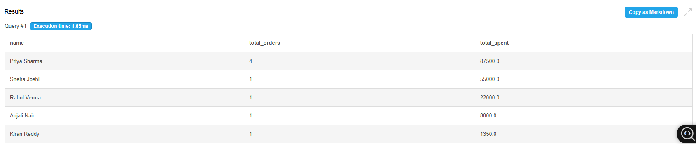
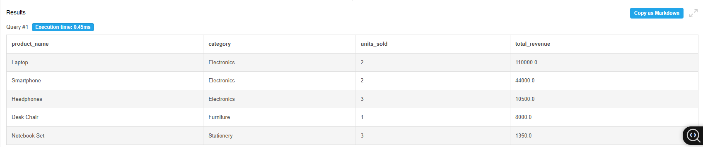
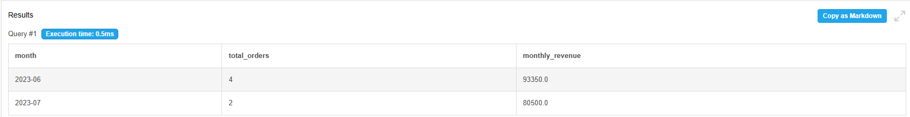
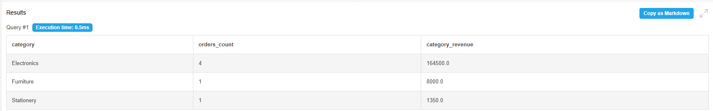
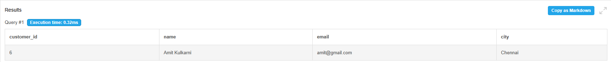
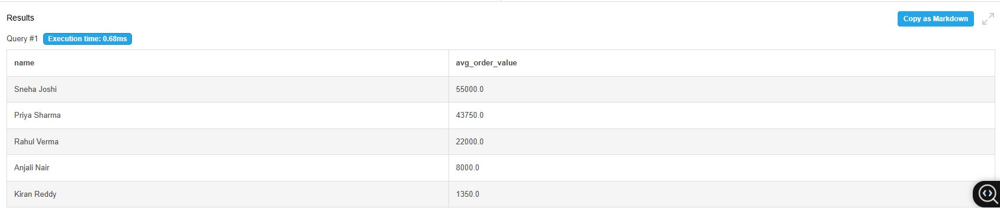
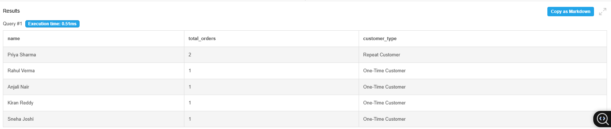
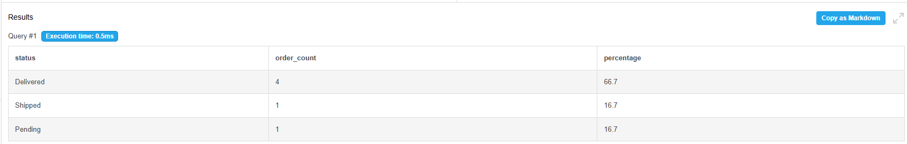

# E-Commerce Sales Analysis | MySQL

## Objective
Analyze e-commerce transactional data to uncover customer 
spending patterns, product performance, revenue trends, 
and order insights using MySQL 8.0.

## Dataset
- Source: Simulated E-Commerce Database
- Tables: 4 (customers, products, orders, order_items)
- Records: 6 customers | 5 products | 6 orders | 8 order items
- Format: SQL

## Tools Used
- MySQL 8.0
- DB Fiddle (Online SQL Playground)

## Key Findings
- Priya Sharma is the top customer with 4 orders worth ₹87,500
- Laptop is the highest revenue product at ₹1,10,000
- Electronics category dominates with highest overall revenue
- 1 out of 6 customers never placed an order (inactive)
- June 2023 recorded highest number of orders
- 50% of orders were successfully delivered

## Queries Covered
1. Customer Spending Summary — total orders and revenue per customer
2. Top Selling Products — ranked by units sold and revenue
3. Monthly Sales Trend — month-on-month revenue tracking
4. Category-wise Revenue — revenue breakdown by product category
5. Customers with No Orders — inactive customer identification
6. Average Order Value — average spend per order per customer
7. Repeat vs One-Time Customers — customer loyalty classification
8. Order Status Breakdown — orders by delivery status with percentage

## Query Results

### Query 1 - Customer Spending Summary

### Query 2 - Top Selling Products

### Query 3 - Monthly Sales Trend

### Query 4 - Category-wise Revenue

### Query 5 - Customers with No Orders

### Query 6 - Average Order Value

### Query 7 - Repeat vs One-Time Customers

### Query 8 - Order Status Breakdown

